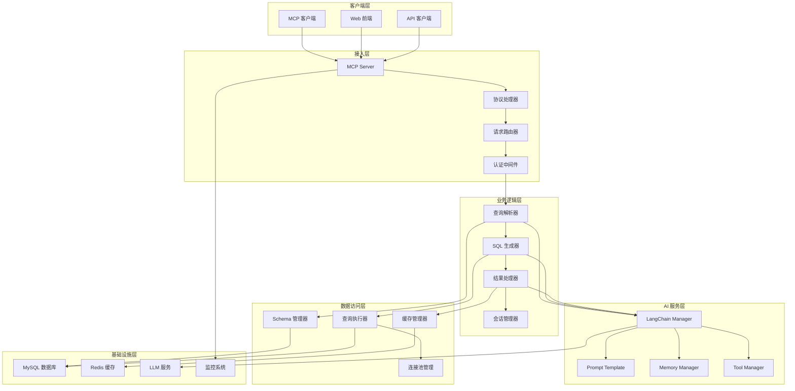
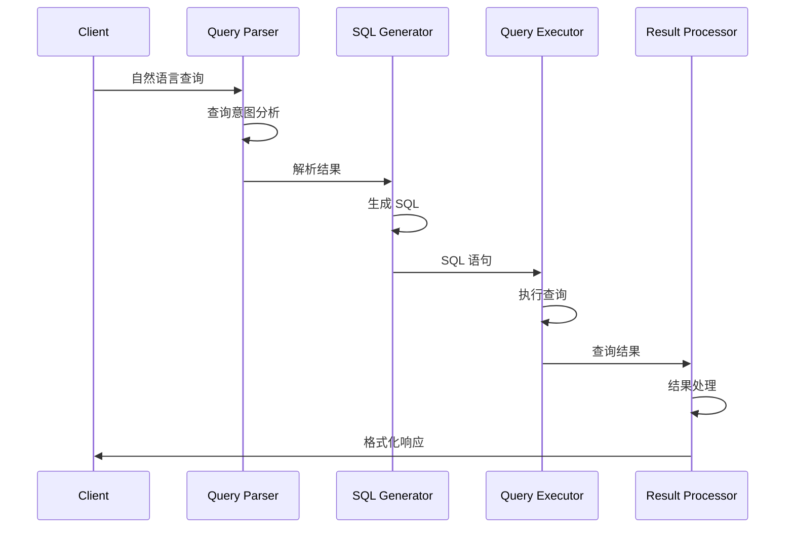
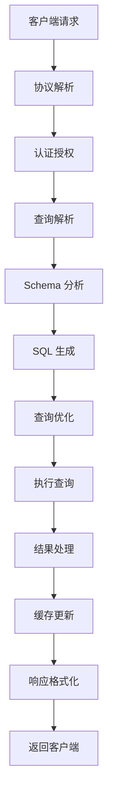
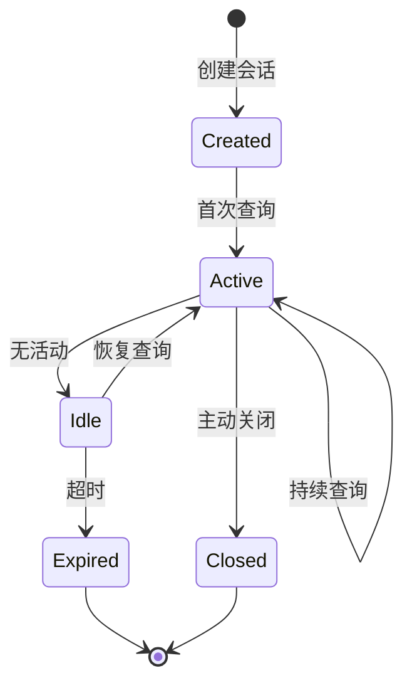
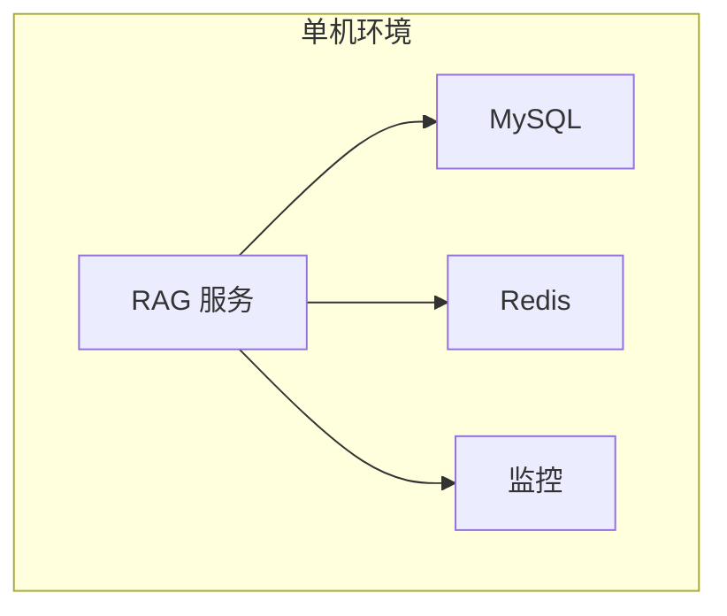
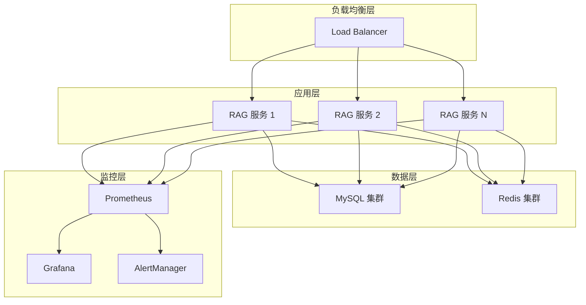

# 系统架构概述

## 整体架构

RAG MySQL 查询系统采用分层架构设计，从上到下分为以下几层：



## 架构特点

### 1. 分层设计

- **清晰的职责分离**: 每层都有明确的职责边界
- **松耦合**: 层与层之间通过接口交互
- **可扩展性**: 每层都可以独立扩展和优化

### 2. 模块化组件

- **独立部署**: 核心组件可以独立部署和扩展
- **插件化**: 支持插件式扩展新功能
- **配置驱动**: 通过配置文件控制组件行为

### 3. 异步处理

- **非阻塞 I/O**: 使用 Go 的 goroutine 实现高并发
- **消息队列**: 支持异步任务处理
- **流式处理**: 支持大数据量的流式查询

## 核心组件

### 1. MCP 服务器 (MCP Server)

**职责**:

- 处理 MCP 协议通信
- 管理客户端连接
- 请求路由和负载均衡

**关键特性**:

- WebSocket 长连接支持
- 多客户端并发处理
- 协议版本兼容性管理
- 连接状态监控

**接口定义**:

```go
type MCPServer interface {
    Start(ctx context.Context, config *ServerConfig) error
    Stop(ctx context.Context) error
    RegisterHandler(method string, handler MCPHandler) error
    BroadcastNotification(notification *MCPNotification) error
    GetConnectedClients() []ClientInfo
}
```

### 2. 查询处理引擎 (Query Processing Engine)

**职责**:

- 自然语言查询解析
- SQL 语句生成和优化
- 查询结果处理和格式化

**处理流程**:



### 3. LangChain 集成层

**职责**:

- LLM 模型管理
- 提示模板处理
- 对话上下文维护
- 工具链管理

**组件架构**:

```go
type LangChainManager struct {
    llmProvider  LLMProvider
    templates    *TemplateManager
    memory       *MemoryManager
    tools        *ToolManager
    chains       map[string]Chain
}
```

### 4. 数据访问层

**职责**:

- 数据库连接管理
- Schema 信息缓存
- 查询执行和优化
- 结果缓存管理

**连接池设计**:

```go
type ConnectionPool struct {
    maxOpen     int
    maxIdle     int
    maxLifetime time.Duration
    connections chan *sql.DB
    stats       *PoolStats
}
```

## 数据流设计

### 1. 查询处理流程



### 2. 缓存策略

**多层缓存架构**:

- **L1 缓存**: 内存缓存，存储热点数据
- **L2 缓存**: Redis 缓存，存储 Schema 和查询结果
- **L3 缓存**: 数据库查询缓存

**缓存更新策略**:

- **TTL 过期**: 基于时间的自动过期
- **LRU 淘汰**: 最近最少使用淘汰算法
- **主动刷新**: Schema 变更时主动刷新

### 3. 会话管理

**会话生命周期**:



## 安全架构

### 1. 认证机制

- **JWT Token**: 基于 JWT 的无状态认证
- **API Key**: 支持 API Key 认证
- **OAuth 2.0**: 支持第三方认证

### 2. 授权控制

- **RBAC**: 基于角色的访问控制
- **资源权限**: 细粒度的资源访问控制
- **查询限制**: 基于用户角色的查询限制

### 3. 安全防护

- **SQL 注入防护**: 参数化查询和输入验证
- **XSS 防护**: 输出编码和内容安全策略
- **CSRF 防护**: Token 验证和 SameSite Cookie
- **限流控制**: 基于用户和 IP 的请求限流

## 性能设计

### 1. 并发处理

- **Goroutine 池**: 控制并发数量，避免资源耗尽
- **连接复用**: 数据库连接池和 HTTP 连接复用
- **异步处理**: 非关键路径的异步处理

### 2. 查询优化

- **查询计划缓存**: 缓存 SQL 执行计划
- **索引建议**: 基于查询模式的索引建议
- **分页优化**: 高效的分页查询实现

### 3. 内存管理

- **对象池**: 复用频繁创建的对象
- **内存监控**: 实时监控内存使用情况
- **GC 优化**: 减少 GC 压力的设计

## 可观测性

### 1. 日志系统

- **结构化日志**: 使用 JSON 格式的结构化日志
- **日志级别**: 支持多级别日志输出
- **日志聚合**: 集中式日志收集和分析

### 2. 监控指标

- **业务指标**: 查询成功率、响应时间等
- **系统指标**: CPU、内存、网络使用率
- **自定义指标**: 业务相关的自定义监控

### 3. 链路追踪

- **分布式追踪**: 跨组件的请求追踪
- **性能分析**: 识别性能瓶颈
- **错误追踪**: 快速定位错误根因

## 扩展性设计

### 1. 水平扩展

- **无状态设计**: 服务无状态，支持水平扩展
- **负载均衡**: 支持多种负载均衡策略
- **服务发现**: 自动服务注册和发现

### 2. 插件系统

- **插件接口**: 标准化的插件开发接口
- **热插拔**: 支持运行时插件加载和卸载
- **配置驱动**: 通过配置启用/禁用插件

### 3. 多数据源支持

- **数据源抽象**: 统一的数据源访问接口
- **驱动插件**: 支持多种数据库驱动
- **查询转换**: 不同数据源的查询语法转换

## 部署架构

### 1. 单机部署



### 2. 集群部署



### 3. 云原生部署

- **容器化**: Docker 容器部署
- **编排**: Kubernetes 集群管理
- **服务网格**: Istio 服务治理
- **CI/CD**: 自动化构建和部署

## 技术选型

### 1. 核心技术

- **Go 1.24.2**: 高性能、并发友好的系统语言
- **Gin**: 轻量级、高性能的 Web 框架
- **XORM**: 功能丰富的 ORM 框架
- **LangChain Go**: LLM 集成和管理

### 2. 存储技术

- **MySQL 8.0**: 主要数据存储
- **Redis 7.0**: 缓存和会话存储
- **MinIO**: 对象存储（可选）

### 3. 监控技术

- **Prometheus**: 指标收集和存储
- **Grafana**: 监控仪表板
- **Jaeger**: 分布式链路追踪
- **ELK Stack**: 日志收集和分析

### 4. 部署技术

- **Docker**: 容器化部署
- **Kubernetes**: 容器编排
- **Helm**: 应用包管理
- **ArgoCD**: GitOps 部署

## 设计原则

### 1. 高可用性

- **故障隔离**: 组件故障不影响整体系统
- **优雅降级**: 部分功能不可用时的降级策略
- **快速恢复**: 故障后的快速恢复机制

### 2. 高性能

- **缓存优先**: 多层缓存提升响应速度
- **异步处理**: 非阻塞的异步处理模式
- **资源优化**: 合理的资源使用和回收

### 3. 可维护性

- **模块化**: 清晰的模块边界和职责
- **文档完善**: 完整的代码和 API 文档
- **测试覆盖**: 高质量的单元和集成测试

### 4. 安全性

- **纵深防御**: 多层安全防护机制
- **最小权限**: 最小权限原则的访问控制
- **安全审计**: 完整的安全审计日志

这个架构设计确保了系统的可扩展性、可维护性和高性能，为后续的功能扩展和优化提供了坚实的基础。
