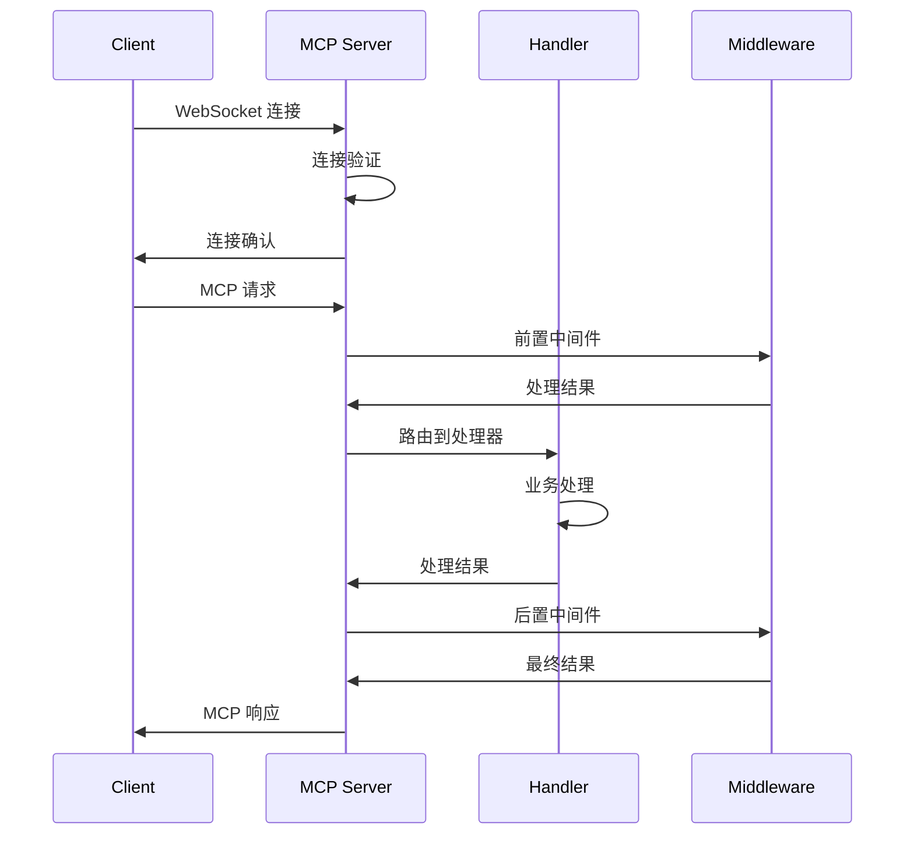
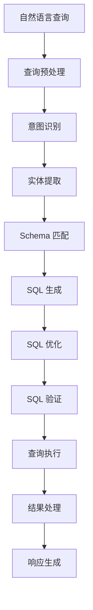

# 核心组件设计

本文档详细介绍 RAG MySQL 查询系统的各个核心组件的设计和实现。

## 组件概览

系统主要由以下核心组件组成：

1. **MCP 服务器** - 协议处理和连接管理
2. **查询处理引擎** - 自然语言查询处理
3. **LangChain 集成层** - LLM 服务集成
4. **Schema 管理器** - 数据库结构管理
5. **缓存管理器** - 多层缓存实现
6. **会话管理器** - 用户会话管理
7. **安全管理器** - 认证授权和安全控制
8. **监控管理器** - 系统监控和健康检查

## 1. MCP 服务器 (MCP Server)

### 设计目标

- 实现标准的 MCP 协议通信
- 支持多客户端并发连接
- 提供高性能的消息处理
- 支持协议版本兼容性

### 核心接口

```go
// MCP 服务器主接口
type MCPServer interface {
    Start(ctx context.Context, config *ServerConfig) error
    Stop(ctx context.Context) error
    RegisterHandler(method string, handler MCPHandler) error
    UnregisterHandler(method string) error
    BroadcastNotification(notification *MCPNotification) error
    GetConnectedClients() []ClientInfo
    GetServerStats() *ServerStats
}

// 消息处理器接口
type MCPHandler interface {
    Handle(ctx context.Context, request *MCPRequest) (*MCPResponse, error)
    GetMethodName() string
    GetDescription() string
}

// 连接管理器接口
type ConnectionManager interface {
    AddConnection(conn *Connection) error
    RemoveConnection(connID string) error
    GetConnection(connID string) (*Connection, error)
    GetAllConnections() []*Connection
    BroadcastMessage(message *MCPMessage) error
}
```

### 实现架构

```go
type mcpServer struct {
    config      *ServerConfig
    connManager ConnectionManager
    handlers    map[string]MCPHandler
    middleware  []Middleware
    logger      log.Logger
    metrics     *ServerMetrics
    ctx         context.Context
    cancel      context.CancelFunc
}

// 服务器配置
type ServerConfig struct {
    Host            string        `yaml:"host"`
    Port            int           `yaml:"port"`
    MaxConnections  int           `yaml:"max_connections"`
    ReadTimeout     time.Duration `yaml:"read_timeout"`
    WriteTimeout    time.Duration `yaml:"write_timeout"`
    IdleTimeout     time.Duration `yaml:"idle_timeout"`
    EnableTLS       bool          `yaml:"enable_tls"`
    TLSCertFile     string        `yaml:"tls_cert_file"`
    TLSKeyFile      string        `yaml:"tls_key_file"`
}
```

### 消息处理流程



### 连接管理

```go
type Connection struct {
    ID          string
    RemoteAddr  string
    UserAgent   string
    ConnectedAt time.Time
    LastActive  time.Time
    User        *User
    Session     *Session
    conn        *websocket.Conn
    sendCh      chan *MCPMessage
    closeCh     chan struct{}
    mutex       sync.RWMutex
}

type connectionManager struct {
    connections map[string]*Connection
    mutex       sync.RWMutex
    maxConns    int
    metrics     *ConnectionMetrics
}
```

## 2. 查询处理引擎 (Query Processing Engine)

### 设计目标

- 准确解析自然语言查询意图
- 生成高质量的 SQL 语句
- 优化查询性能
- 提供友好的错误处理

### 核心接口

```go
// 查询处理器主接口
type QueryProcessor interface {
    ProcessQuery(ctx context.Context, request *QueryRequest) (*QueryResponse, error)
    ExplainQuery(ctx context.Context, query string) (*QueryExplanation, error)
    GetSuggestions(ctx context.Context, partial string) ([]string, error)
    ValidateQuery(ctx context.Context, query string) (*ValidationResult, error)
}

// 查询解析器接口
type QueryParser interface {
    Parse(ctx context.Context, query string) (*ParsedQuery, error)
    GetQueryType(query string) QueryType
    ExtractEntities(query string) (*QueryEntities, error)
}

// SQL 生成器接口
type SQLGenerator interface {
    GenerateSQL(ctx context.Context, parsed *ParsedQuery, schema *SchemaInfo) (*GeneratedSQL, error)
    OptimizeSQL(ctx context.Context, sql string) (*OptimizedSQL, error)
    ValidateSQL(ctx context.Context, sql string) (*SQLValidation, error)
}
```

### 查询处理流程



### 实现架构

```go
type queryProcessor struct {
    parser      QueryParser
    generator   SQLGenerator
    executor    QueryExecutor
    processor   ResultProcessor
    schema      SchemaManager
    cache       CacheManager
    llm         LangChainManager
    logger      log.Logger
    metrics     *QueryMetrics
}

// 查询请求结构
type QueryRequest struct {
    Query       string            `json:"query" validate:"required"`
    Context     map[string]any    `json:"context,omitempty"`
    Options     *QueryOptions     `json:"options,omitempty"`
    SessionID   string            `json:"session_id,omitempty"`
    UserID      string            `json:"user_id,omitempty"`
}

// 查询选项
type QueryOptions struct {
    Limit       int    `json:"limit,omitempty"`
    Offset      int    `json:"offset,omitempty"`
    Format      string `json:"format,omitempty"` // json, csv, table
    Explain     bool   `json:"explain,omitempty"`
    Optimize    bool   `json:"optimize,omitempty"`
    Timeout     int    `json:"timeout,omitempty"` // seconds
    MaxRows     int    `json:"max_rows,omitempty"`
}
```

### 查询解析器实现

```go
type queryParser struct {
    nlp         NLPProcessor
    patterns    *QueryPatterns
    entities    EntityExtractor
    classifier  QueryClassifier
    cache       map[string]*ParsedQuery
    mutex       sync.RWMutex
}

// 解析结果
type ParsedQuery struct {
    Type        QueryType         `json:"type"`
    Intent      QueryIntent       `json:"intent"`
    Entities    *QueryEntities    `json:"entities"`
    Conditions  []*QueryCondition `json:"conditions"`
    Aggregations []*Aggregation   `json:"aggregations"`
    Sorting     *SortingSpec      `json:"sorting"`
    Pagination  *PaginationSpec   `json:"pagination"`
    Confidence  float64           `json:"confidence"`
}

// 查询类型
type QueryType string

const (
    QueryTypeSelect     QueryType = "select"
    QueryTypeInsert     QueryType = "insert"
    QueryTypeUpdate     QueryType = "update"
    QueryTypeDelete     QueryType = "delete"
    QueryTypeAnalytics  QueryType = "analytics"
    QueryTypeSchema     QueryType = "schema"
)
```

## 3. LangChain 集成层

### 设计目标

- 统一的 LLM 服务接入
- 灵活的提示模板管理
- 高效的对话上下文维护
- 可扩展的工具链系统

### 核心接口

```go
// LangChain 管理器主接口
type LangChainManager interface {
    CreateChain(ctx context.Context, config *ChainConfig) (Chain, error)
    ExecuteChain(ctx context.Context, chainID string, input *ChainInput) (*ChainOutput, error)
    GetChain(chainID string) (Chain, error)
    ListChains() []ChainInfo
    DeleteChain(chainID string) error
}

// Chain 接口
type Chain interface {
    Run(ctx context.Context, input *ChainInput) (*ChainOutput, error)
    GetID() string
    GetType() ChainType
    GetTools() []Tool
    AddTool(tool Tool) error
    RemoveTool(toolName string) error
    GetMemory() Memory
    SetMemory(memory Memory) error
}

// 工具接口
type Tool interface {
    Name() string
    Description() string
    Execute(ctx context.Context, input *ToolInput) (*ToolOutput, error)
    GetSchema() *ToolSchema
}
```

### 实现架构

```go
type langChainManager struct {
    llmProvider  LLMProvider
    templates    *TemplateManager
    memory       *MemoryManager
    tools        *ToolManager
    chains       map[string]Chain
    config       *LangChainConfig
    metrics      *LangChainMetrics
    mutex        sync.RWMutex
}

// LLM 提供者接口
type LLMProvider interface {
    GenerateText(ctx context.Context, prompt string, options *GenerateOptions) (*GenerateResult, error)
    GenerateStream(ctx context.Context, prompt string, options *GenerateOptions) (<-chan *StreamResult, error)
    GetModelInfo() *ModelInfo
    GetUsage() *UsageStats
}

// 提示模板管理器
type TemplateManager struct {
    templates map[string]*PromptTemplate
    loader    TemplateLoader
    cache     TemplateCache
    mutex     sync.RWMutex
}
```

### 工具系统设计

```go
// SQL 生成工具
type SQLGeneratorTool struct {
    name        string
    description string
    schema      SchemaManager
    generator   SQLGenerator
    validator   SQLValidator
}

func (t *SQLGeneratorTool) Execute(ctx context.Context, input *ToolInput) (*ToolOutput, error) {
    query := input.GetString("query")
    schemaInfo := input.GetObject("schema").(*SchemaInfo)

    // 生成 SQL
    sql, err := t.generator.GenerateSQL(ctx, query, schemaInfo)
    if err != nil {
        return nil, err
    }

    // 验证 SQL
    validation, err := t.validator.ValidateSQL(ctx, sql.Statement)
    if err != nil {
        return nil, err
    }

    return &ToolOutput{
        Result: map[string]any{
            "sql":        sql.Statement,
            "validation": validation,
            "metadata":   sql.Metadata,
        },
    }, nil
}

// 查询优化工具
type QueryOptimizerTool struct {
    name      string
    analyzer  QueryAnalyzer
    optimizer QueryOptimizer
}

// Schema 分析工具
type SchemaAnalyzerTool struct {
    name    string
    manager SchemaManager
    cache   SchemaCache
}
```

## 4. Schema 管理器

### 设计目标

- 自动发现和加载数据库结构
- 智能分析表关系
- 高效的 Schema 缓存
- 支持 Schema 变更检测

### 核心接口

```go
// Schema 管理器主接口
type SchemaManager interface {
    LoadSchema(ctx context.Context) error
    RefreshSchema(ctx context.Context) error
    GetTableInfo(tableName string) (*TableInfo, error)
    GetAllTables() ([]*TableInfo, error)
    GetRelationships(tableName string) ([]*Relationship, error)
    FindSimilarTables(query string) ([]*TableInfo, error)
    GetSchemaVersion() string
    WatchSchemaChanges(ctx context.Context) (<-chan *SchemaChange, error)
}

// Schema 加载器接口
type SchemaLoader interface {
    LoadTables(ctx context.Context) ([]*TableInfo, error)
    LoadViews(ctx context.Context) ([]*ViewInfo, error)
    LoadIndexes(ctx context.Context) ([]*IndexInfo, error)
    LoadForeignKeys(ctx context.Context) ([]*ForeignKeyInfo, error)
    LoadConstraints(ctx context.Context) ([]*ConstraintInfo, error)
}

// 关系分析器接口
type RelationshipAnalyzer interface {
    AnalyzeRelationships(tables []*TableInfo) ([]*Relationship, error)
    FindJoinPaths(fromTable, toTable string) ([]*JoinPath, error)
    SuggestJoins(tables []string) ([]*JoinSuggestion, error)
}
```

### 实现架构

```go
type schemaManager struct {
    loader      SchemaLoader
    analyzer    RelationshipAnalyzer
    cache       SchemaCache
    db          *sql.DB
    config      *SchemaConfig
    version     string
    lastUpdate  time.Time
    mutex       sync.RWMutex
    watchers    []chan *SchemaChange
}

// 表信息结构
type TableInfo struct {
    Name         string         `json:"name"`
    Schema       string         `json:"schema"`
    Comment      string         `json:"comment"`
    Engine       string         `json:"engine"`
    Charset      string         `json:"charset"`
    Collation    string         `json:"collation"`
    Columns      []*Column      `json:"columns"`
    Indexes      []*Index       `json:"indexes"`
    ForeignKeys  []*ForeignKey  `json:"foreign_keys"`
    Constraints  []*Constraint  `json:"constraints"`
    RowCount     int64          `json:"row_count"`
    DataLength   int64          `json:"data_length"`
    IndexLength  int64          `json:"index_length"`
    CreatedAt    time.Time      `json:"created_at"`
    UpdatedAt    time.Time      `json:"updated_at"`
}

// 列信息结构
type Column struct {
    Name            string `json:"name"`
    Type            string `json:"type"`
    DataType        string `json:"data_type"`
    Length          int    `json:"length,omitempty"`
    Precision       int    `json:"precision,omitempty"`
    Scale           int    `json:"scale,omitempty"`
    Nullable        bool   `json:"nullable"`
    DefaultValue    string `json:"default_value,omitempty"`
    Comment         string `json:"comment,omitempty"`
    IsPrimaryKey    bool   `json:"is_primary_key"`
    IsAutoIncrement bool   `json:"is_auto_increment"`
    IsUnique        bool   `json:"is_unique"`
    CharacterSet    string `json:"character_set,omitempty"`
    Collation       string `json:"collation,omitempty"`
    Position        int    `json:"position"`
}
```

### 关系分析实现

```go
type relationshipAnalyzer struct {
    patterns    *RelationshipPatterns
    heuristics  *NamingHeuristics
    cache       map[string][]*Relationship
    mutex       sync.RWMutex
}

// 关系类型
type RelationshipType string

const (
    RelationshipOneToOne   RelationshipType = "one_to_one"
    RelationshipOneToMany  RelationshipType = "one_to_many"
    RelationshipManyToMany RelationshipType = "many_to_many"
)

// 关系信息
type Relationship struct {
    Type         RelationshipType `json:"type"`
    FromTable    string          `json:"from_table"`
    FromColumn   string          `json:"from_column"`
    ToTable      string          `json:"to_table"`
    ToColumn     string          `json:"to_column"`
    Constraint   string          `json:"constraint,omitempty"`
    OnUpdate     string          `json:"on_update,omitempty"`
    OnDelete     string          `json:"on_delete,omitempty"`
    Confidence   float64         `json:"confidence"`
    Source       string          `json:"source"` // foreign_key, naming, heuristic
}
```

## 5. 缓存管理器

### 设计目标

- 多层缓存架构
- 智能缓存策略
- 高性能缓存访问
- 缓存一致性保证

### 核心接口

```go
// 缓存管理器主接口
type CacheManager interface {
    Get(ctx context.Context, key string) (any, error)
    Set(ctx context.Context, key string, value any, ttl time.Duration) error
    Delete(ctx context.Context, key string) error
    Clear(ctx context.Context, pattern string) error
    GetStats() *CacheStats
    Invalidate(ctx context.Context, tags []string) error
}

// 多层缓存接口
type MultiLevelCache interface {
    CacheManager
    GetL1Cache() Cache
    GetL2Cache() Cache
    SetL1Cache(cache Cache)
    SetL2Cache(cache Cache)
}

// 缓存后端接口
type Cache interface {
    Get(ctx context.Context, key string) ([]byte, error)
    Set(ctx context.Context, key string, value []byte, ttl time.Duration) error
    Delete(ctx context.Context, key string) error
    Exists(ctx context.Context, key string) (bool, error)
    TTL(ctx context.Context, key string) (time.Duration, error)
}
```

### 实现架构

```go
type cacheManager struct {
    l1Cache     Cache           // 内存缓存
    l2Cache     Cache           // Redis 缓存
    serializer  Serializer      // 序列化器
    compressor  Compressor      // 压缩器
    metrics     *CacheMetrics   // 监控指标
    config      *CacheConfig    // 配置
}

// 缓存配置
type CacheConfig struct {
    L1Config *MemoryCacheConfig `yaml:"l1"`
    L2Config *RedisCacheConfig  `yaml:"l2"`
    DefaultTTL time.Duration    `yaml:"default_ttl"`
    MaxKeySize int              `yaml:"max_key_size"`
    MaxValueSize int            `yaml:"max_value_size"`
    EnableCompression bool      `yaml:"enable_compression"`
    CompressionThreshold int    `yaml:"compression_threshold"`
}

// 内存缓存配置
type MemoryCacheConfig struct {
    MaxSize     int           `yaml:"max_size"`
    MaxEntries  int           `yaml:"max_entries"`
    TTL         time.Duration `yaml:"ttl"`
    CleanupInterval time.Duration `yaml:"cleanup_interval"`
}
```

### 缓存策略

```go
// 缓存键生成器
type CacheKeyGenerator struct {
    prefix    string
    separator string
    hasher    hash.Hash
}

func (g *CacheKeyGenerator) GenerateKey(parts ...string) string {
    key := g.prefix + g.separator + strings.Join(parts, g.separator)
    if len(key) > 250 { // Redis key 长度限制
        g.hasher.Reset()
        g.hasher.Write([]byte(key))
        return g.prefix + g.separator + hex.EncodeToString(g.hasher.Sum(nil))
    }
    return key
}

// 缓存标签管理
type CacheTagManager struct {
    tagIndex map[string][]string // tag -> keys
    keyTags  map[string][]string // key -> tags
    mutex    sync.RWMutex
}

// 缓存预热器
type CacheWarmer interface {
    WarmUp(ctx context.Context) error
    WarmUpTable(ctx context.Context, tableName string) error
    WarmUpQuery(ctx context.Context, query string) error
}
```

## 6. 会话管理器

### 设计目标

- 高效的会话存储和检索
- 智能的会话生命周期管理
- 上下文感知的查询处理
- 会话数据的持久化

### 核心接口

```go
// 会话管理器主接口
type SessionManager interface {
    CreateSession(ctx context.Context, userID string) (*Session, error)
    GetSession(ctx context.Context, sessionID string) (*Session, error)
    UpdateSession(ctx context.Context, session *Session) error
    DeleteSession(ctx context.Context, sessionID string) error
    ListUserSessions(ctx context.Context, userID string) ([]*Session, error)
    CleanupExpiredSessions(ctx context.Context) error
}

// 会话存储接口
type SessionStorage interface {
    Save(ctx context.Context, session *Session) error
    Load(ctx context.Context, sessionID string) (*Session, error)
    Delete(ctx context.Context, sessionID string) error
    List(ctx context.Context, userID string) ([]*Session, error)
    Cleanup(ctx context.Context, expiredBefore time.Time) error
}

// 会话内存接口
type SessionMemory interface {
    AddQuery(query *QueryHistory) error
    GetQueries(limit int) ([]*QueryHistory, error)
    GetContext() map[string]any
    SetContext(key string, value any) error
    ClearContext() error
}
```

### 实现架构

```go
type sessionManager struct {
    storage     SessionStorage
    memory      MemoryManager
    config      *SessionConfig
    metrics     *SessionMetrics
    cleaner     *SessionCleaner
    mutex       sync.RWMutex
}

// 会话结构
type Session struct {
    ID          string                 `json:"id"`
    UserID      string                 `json:"user_id"`
    CreatedAt   time.Time              `json:"created_at"`
    UpdatedAt   time.Time              `json:"updated_at"`
    LastActive  time.Time              `json:"last_active"`
    ExpiresAt   time.Time              `json:"expires_at"`
    Status      SessionStatus          `json:"status"`
    Context     map[string]any         `json:"context"`
    Preferences *UserPreferences       `json:"preferences"`
    History     []*QueryHistory        `json:"history"`
    Metadata    map[string]string      `json:"metadata"`
}

// 查询历史
type QueryHistory struct {
    ID          string                 `json:"id"`
    Query       string                 `json:"query"`
    SQL         string                 `json:"sql,omitempty"`
    Results     any                    `json:"results,omitempty"`
    Success     bool                   `json:"success"`
    Error       string                 `json:"error,omitempty"`
    Duration    time.Duration          `json:"duration"`
    Timestamp   time.Time              `json:"timestamp"`
    Metadata    map[string]any         `json:"metadata,omitempty"`
}

// 用户偏好设置
type UserPreferences struct {
    Language        string            `json:"language"`
    Timezone        string            `json:"timezone"`
    DateFormat      string            `json:"date_format"`
    NumberFormat    string            `json:"number_format"`
    DefaultLimit    int               `json:"default_limit"`
    ExplainQueries  bool              `json:"explain_queries"`
    SaveHistory     bool              `json:"save_history"`
    CustomSettings  map[string]any    `json:"custom_settings"`
}
```

### 会话清理机制

```go
type SessionCleaner struct {
    manager   SessionManager
    interval  time.Duration
    maxAge    time.Duration
    batchSize int
    logger    log.Logger
    stopCh    chan struct{}
}

func (c *SessionCleaner) Start(ctx context.Context) {
    ticker := time.NewTicker(c.interval)
    defer ticker.Stop()

    for {
        select {
        case <-ticker.C:
            c.cleanup(ctx)
        case <-c.stopCh:
            return
        case <-ctx.Done():
            return
        }
    }
}

func (c *SessionCleaner) cleanup(ctx context.Context) {
    expiredBefore := time.Now().Add(-c.maxAge)
    err := c.manager.CleanupExpiredSessions(ctx)
    if err != nil {
        c.logger.Error("Failed to cleanup expired sessions", "error", err)
    }
}
```

## 7. 安全管理器

### 设计目标

- 多层安全防护
- 细粒度权限控制
- 安全审计和监控
- 威胁检测和防护

### 核心接口

```go
// 安全管理器主接口
type SecurityManager interface {
    Authenticate(ctx context.Context, credentials *Credentials) (*AuthResult, error)
    Authorize(ctx context.Context, user *User, resource string, action string) error
    ValidateToken(ctx context.Context, token string) (*TokenClaims, error)
    RefreshToken(ctx context.Context, refreshToken string) (*TokenPair, error)
    RevokeToken(ctx context.Context, token string) error
    AuditLog(ctx context.Context, event *AuditEvent) error
}

// SQL 安全检查器接口
type SQLSecurityChecker interface {
    CheckSQL(ctx context.Context, sql string, user *User) (*SecurityCheckResult, error)
    DetectInjection(sql string) (*InjectionDetection, error)
    ValidatePermissions(sql string, user *User) error
    SanitizeSQL(sql string) (string, error)
}

// 访问控制接口
type AccessController interface {
    CheckPermission(user *User, resource string, action string) error
    GetUserPermissions(userID string) ([]*Permission, error)
    GetRolePermissions(roleID string) ([]*Permission, error)
    GrantPermission(userID string, permission *Permission) error
    RevokePermission(userID string, permission *Permission) error
}
```

### 实现架构

```go
type securityManager struct {
    auth        Authenticator
    authz       Authorizer
    tokenMgr    TokenManager
    sqlChecker  SQLSecurityChecker
    auditor     AuditLogger
    config      *SecurityConfig
    metrics     *SecurityMetrics
}

// 认证器
type Authenticator struct {
    providers map[string]AuthProvider
    config    *AuthConfig
    cache     AuthCache
}

// 授权器
type Authorizer struct {
    rbac      RBACManager
    policies  PolicyManager
    cache     AuthzCache
}

// Token 管理器
type TokenManager struct {
    signer    TokenSigner
    verifier  TokenVerifier
    store     TokenStore
    config    *TokenConfig
}
```

### SQL 安全检查

```go
type sqlSecurityChecker struct {
    patterns    *SQLPatterns
    whitelist   *SQLWhitelist
    blacklist   *SQLBlacklist
    analyzer    SQLAnalyzer
    sanitizer   SQLSanitizer
}

// SQL 安全检查结果
type SecurityCheckResult struct {
    Allowed     bool                   `json:"allowed"`
    Risk        SecurityRisk           `json:"risk"`
    Violations  []*SecurityViolation   `json:"violations"`
    Suggestions []string               `json:"suggestions"`
}

// 安全风险级别
type SecurityRisk string

const (
    RiskLow      SecurityRisk = "low"
    RiskMedium   SecurityRisk = "medium"
    RiskHigh     SecurityRisk = "high"
    RiskCritical SecurityRisk = "critical"
)

// 安全违规
type SecurityViolation struct {
    Type        ViolationType `json:"type"`
    Description string        `json:"description"`
    Location    string        `json:"location"`
    Severity    SecurityRisk  `json:"severity"`
    Suggestion  string        `json:"suggestion"`
}
```

## 8. 监控管理器

### 设计目标

- 全面的系统监控
- 实时性能指标收集
- 智能告警和通知
- 健康检查和故障检测

### 核心接口

```go
// 监控管理器主接口
type MonitoringManager interface {
    RecordMetric(name string, value float64, tags map[string]string) error
    IncrementCounter(name string, tags map[string]string) error
    RecordHistogram(name string, value float64, tags map[string]string) error
    RecordGauge(name string, value float64, tags map[string]string) error
    GetMetrics() (*MetricsSnapshot, error)
    HealthCheck(ctx context.Context) (*HealthStatus, error)
}

// 健康检查器接口
type HealthChecker interface {
    Check(ctx context.Context) (*HealthResult, error)
    GetName() string
    GetTimeout() time.Duration
}

// 告警管理器接口
type AlertManager interface {
    RegisterAlert(alert *AlertRule) error
    TriggerAlert(ctx context.Context, alert *Alert) error
    GetActiveAlerts() ([]*Alert, error)
    AcknowledgeAlert(alertID string, userID string) error
}
```

### 实现架构

```go
type monitoringManager struct {
    metrics     MetricsCollector
    health      HealthManager
    alerts      AlertManager
    logger      log.Logger
    config      *MonitoringConfig
}

// 指标收集器
type MetricsCollector struct {
    registry    *prometheus.Registry
    counters    map[string]*prometheus.CounterVec
    histograms  map[string]*prometheus.HistogramVec
    gauges      map[string]*prometheus.GaugeVec
    mutex       sync.RWMutex
}

// 健康检查管理器
type HealthManager struct {
    checkers    map[string]HealthChecker
    results     map[string]*HealthResult
    config      *HealthConfig
    mutex       sync.RWMutex
}

// 健康检查结果
type HealthResult struct {
    Name      string                 `json:"name"`
    Status    HealthStatus           `json:"status"`
    Message   string                 `json:"message,omitempty"`
    Details   map[string]any         `json:"details,omitempty"`
    Duration  time.Duration          `json:"duration"`
    Timestamp time.Time              `json:"timestamp"`
}
```

### 内置健康检查器

```go
// 数据库健康检查器
type DatabaseHealthChecker struct {
    name    string
    db      *sql.DB
    timeout time.Duration
}

func (c *DatabaseHealthChecker) Check(ctx context.Context) (*HealthResult, error) {
    start := time.Now()

    ctx, cancel := context.WithTimeout(ctx, c.timeout)
    defer cancel()

    err := c.db.PingContext(ctx)
    duration := time.Since(start)

    result := &HealthResult{
        Name:      c.name,
        Duration:  duration,
        Timestamp: time.Now(),
    }

    if err != nil {
        result.Status = HealthStatusUnhealthy
        result.Message = err.Error()
    } else {
        result.Status = HealthStatusHealthy
        result.Message = "Database connection is healthy"
    }

    return result, nil
}

// Redis 健康检查器
type RedisHealthChecker struct {
    name    string
    client  redis.Client
    timeout time.Duration
}

// LLM 服务健康检查器
type LLMHealthChecker struct {
    name     string
    provider LLMProvider
    timeout  time.Duration
}
```

这些核心组件通过清晰的接口定义和模块化设计，确保了系统的可维护性、可扩展性和高性能。每个组件都有明确的职责边界，便于独立开发、测试和部署。
