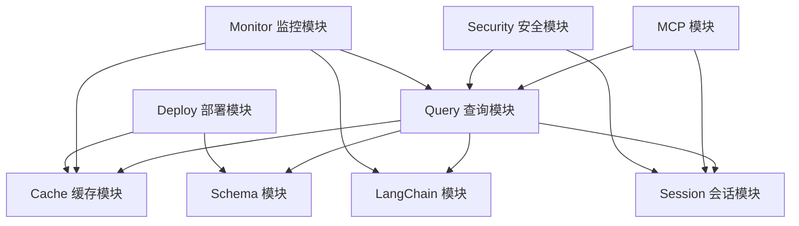

# 模块概览

RAG MySQL 查询系统采用模块化架构设计，每个模块负责特定的功能领域。

## 核心模块

### [缓存模块 (Cache)](cache.md)

负责查询结果和 Schema 信息的缓存管理，提供内存缓存、Redis 缓存和缓存优化功能。

### [查询模块 (Query)](query.md)

处理自然语言查询的解析、SQL 生成和执行，是系统的核心功能模块。

### [Schema 模块 (Schema)](schema.md)

负责数据库 Schema 的加载、分析和管理，提供表结构信息和关系识别。

### [会话模块 (Session)](session.md)

管理用户会话和查询上下文，维护查询历史和用户偏好设置。

## 集成模块

### [LangChain 模块 (LangChain)](langchain.md)

与 LangChain 框架的集成，提供 LLM 调用和 Chain 管理功能。

### [MCP 模块 (MCP)](mcp.md)

实现 Model Context Protocol 协议，提供标准化的通信接口。

## 支持模块

### [监控模块 (Monitor)](monitor.md)

提供系统监控、日志记录和指标收集功能，确保系统的可观测性。

### [安全模块 (Security)](security.md)

负责认证、授权、数据脱敏和安全审计，保障系统安全。

### [部署模块 (Deploy)](deploy.md)

提供系统生命周期管理和数据库迁移功能，支持优雅启停和版本升级。

## 模块依赖关系

## 模块特性

- **松耦合设计**：模块间通过接口交互，便于独立开发和测试
- **可插拔架构**：支持模块的动态加载和替换
- **统一配置**：所有模块共享统一的配置管理
- **完整测试**：每个模块都有完整的单元测试和集成测试
- **详细文档**：每个模块都有详细的 API 文档和使用说明

## 开发指南

1. **模块开发**：遵循统一的接口规范和编码标准
2. **测试要求**：确保测试覆盖率达到 80% 以上
3. **文档维护**：及时更新模块文档和 API 说明
4. **版本管理**：遵循语义化版本控制规范

详细的开发指南请参考 [开发文档](../development/README.md)。
